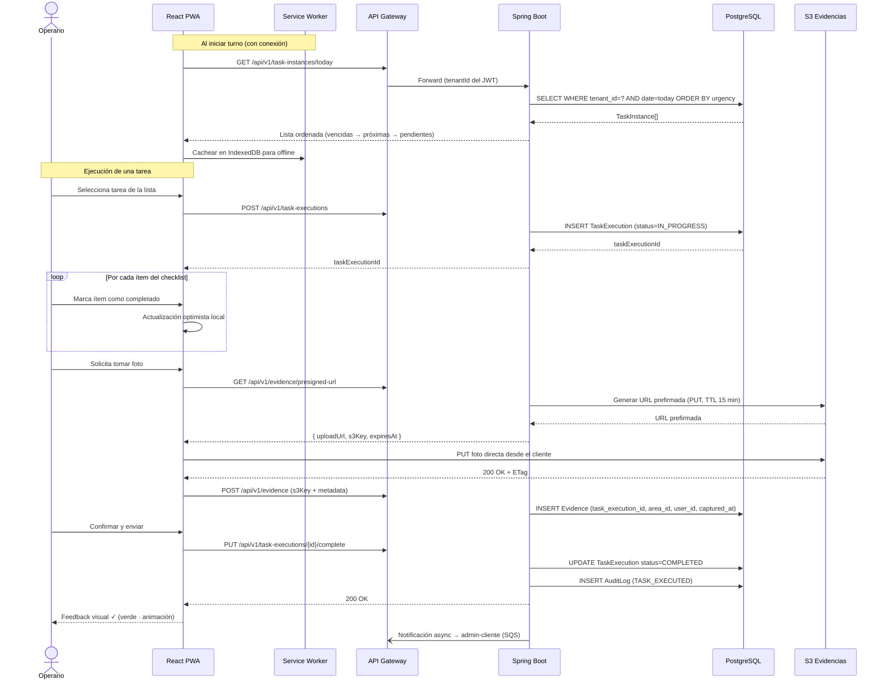
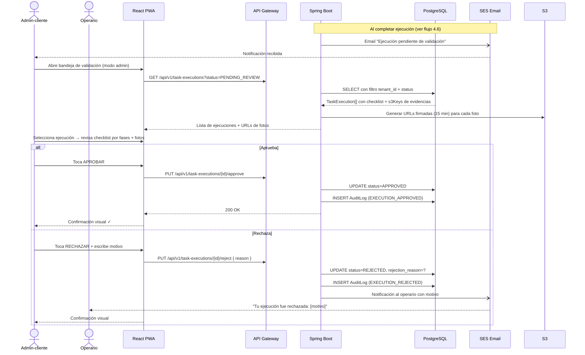
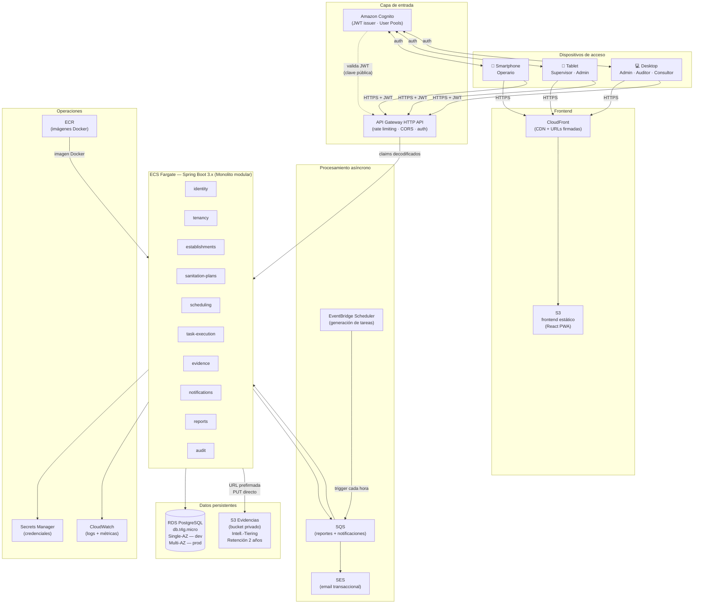
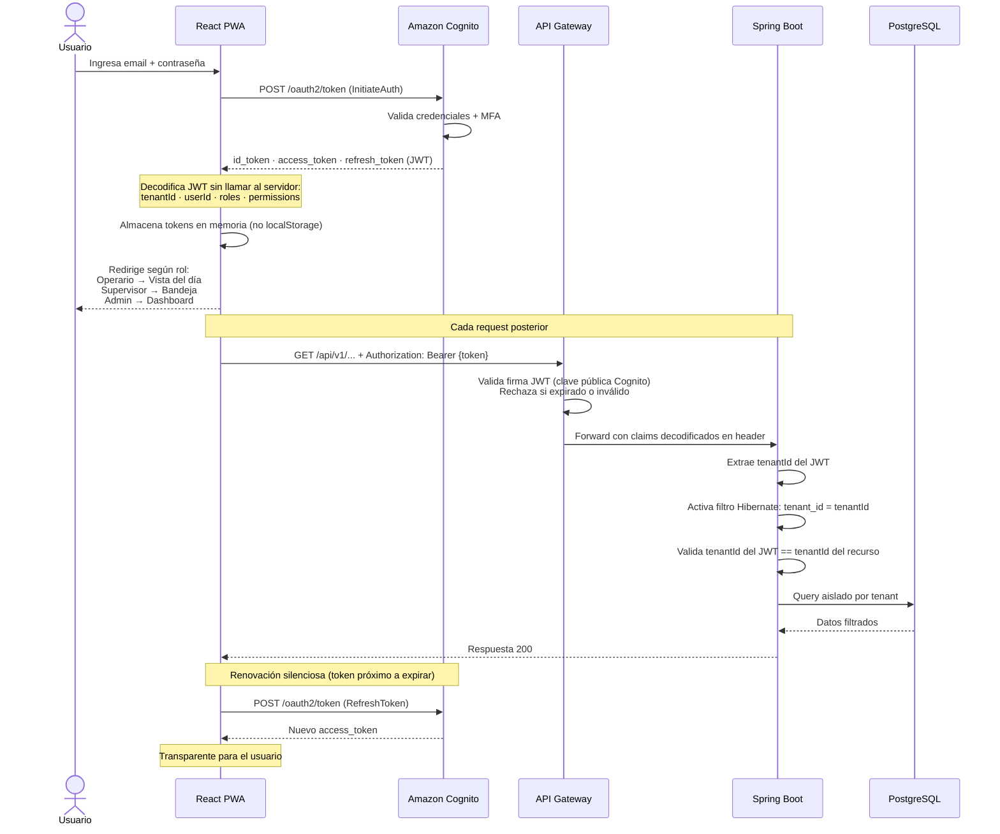
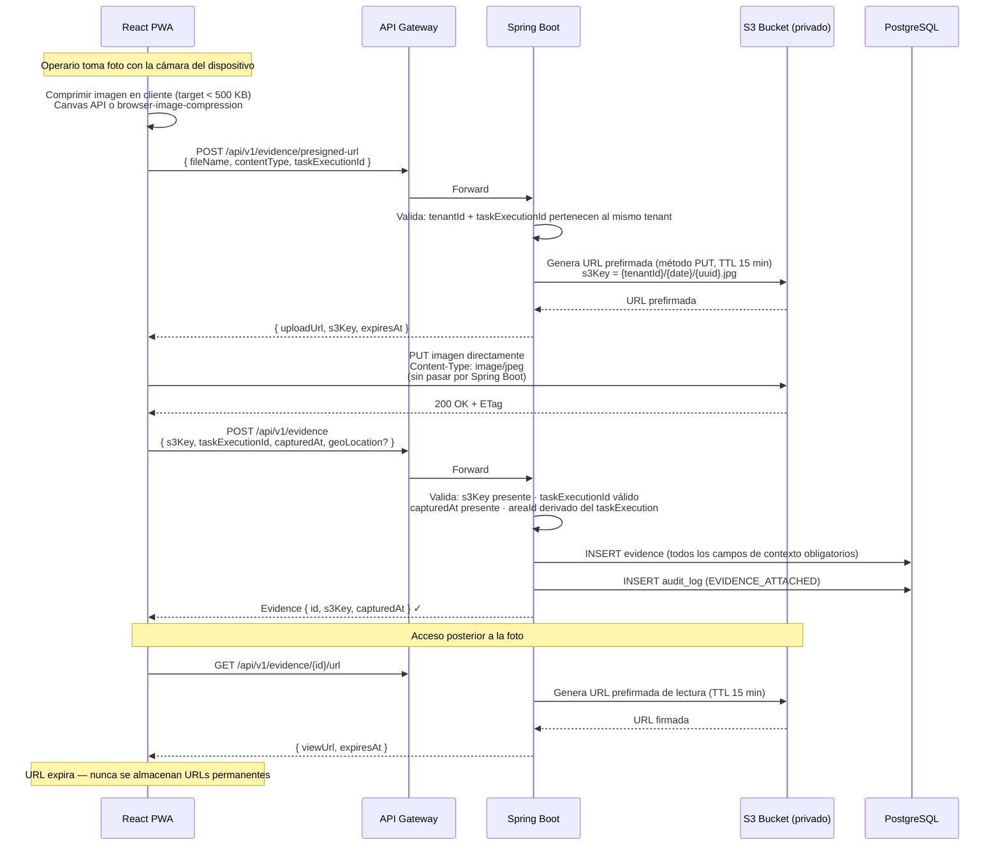
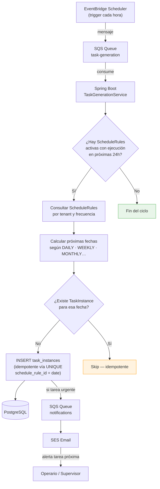
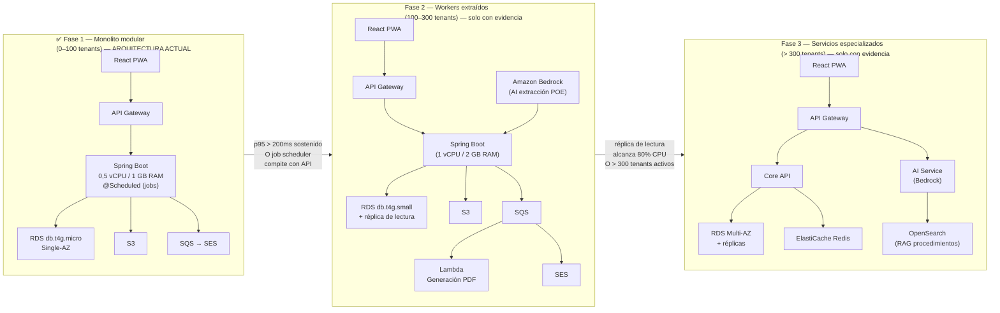

# Plan de Implementación v2 — SanitIA

> Plataforma SaaS B2B multi-tenant para digitalizar planes de saneamiento sanitario en Colombia.  
> Actualizado: mayo 2026.

---

## 0. Marco regulatorio colombiano

El sistema no puede diseñarse sin entender el marco legal que obliga a sus usuarios. Cada módulo tiene un ancla normativa.

### Normas principales

| Norma | Alcance | Impacto en el sistema |
|---|---|---|
| **Resolución 2674 de 2013** (Min. Salud) | Fabricación, procesamiento, envasado, almacenamiento, distribución y comercialización de alimentos | Marco base: 4 programas mínimos, registros, cronogramas, listas de chequeo, responsables. Documento disponible para autoridad sanitaria. |
| **Decreto 1500 de 2007** (Min. Protección Social) | Plantas de beneficio, desposte y productos cárnicos | 8 POES obligatorios con mayor rigor; trazabilidad desde lote hasta consumidor; supervisión exclusiva INVIMA |
| **Resolución 0719 de 2015** (Min. Salud) | Clasificación de alimentos por riesgo sanitario | Determina el nivel de rigor de cada checklist (Riesgo Alto: mayor frecuencia, evidencias obligatorias) |
| **Resolución 2115 de 2007** (Min. Ambiente) | Características, instrumentos básicos y frecuencias para el análisis de la calidad del agua | Define parámetros y frecuencias de monitoreo del programa de agua potable |
| **Resolución 5109 de 2005** | Rotulado de alimentos y materias primas | Aplica al módulo de insumos y trazabilidad de productos químicos |
| **Resolución 1229 de 2013** | Modelo de Inspección, Vigilancia y Control sanitario para alimentos y bebidas | Define el proceso formal de visita INVIMA — el sistema debe preparar evidencias para este protocolo |

### Implicaciones de diseño no negociables

1. **Registros disponibles para autoridad sanitaria en cualquier momento** → el sistema debe tener una "vista de auditoría" exportable con filtros por periodo, área y programa.
2. **Cada ejecución vinculada a la versión vigente del POE** → versionamiento obligatorio de procedimientos antes de Fase 1.
3. **Productos químicos con registro INVIMA** → el módulo de insumos debe registrar el número de registro sanitario de cada producto.
4. **Capacitación de manipuladores** → Artículo 14 de la Resolución 2674 exige que los manipuladores reciban capacitación, con registros. El sistema debe gestionar esto.
5. **Decreto 1500 para cárnicos** → los clientes de este segmento requieren 8 POES específicos; el constructor debe reconocer esta tipología.

### Los 4 programas mínimos (Resolución 2674, Art. 26)

```
1. Limpieza y Desinfección (L&D)
   └─ Procedimientos escritos, agentes, concentraciones, tiempos de contacto, periodicidad

2. Manejo de Residuos Sólidos y Líquidos
   └─ Identificación de residuos generados, almacenamiento, disposición final

3. Control Integrado de Plagas (CIP)
   └─ Medidas preventivas y correctivas, proveedor externo certificado

4. Abastecimiento de Agua Potable
   └─ Fuente/suministro, tratamientos, tanque almacenamiento, distribución, mantenimiento, controles
```

### Los 8 POES adicionales para cárnicos (Decreto 1500)

```
POES-01: Seguridad del agua
POES-02: Limpieza de superficies en contacto con alimentos
POES-03: Prevención de contaminación cruzada
POES-04: Mantenimiento de instalaciones de lavado y desinfección
POES-05: Protección de adulterantes
POES-06: Etiquetado, almacenamiento y uso de compuestos tóxicos
POES-07: Condiciones de salud del personal
POES-08: Control de plagas
```

---

## 1. Problema que se resuelve

El sistema no es "una app de checklists". Es una **plataforma de cumplimiento sanitario operativo** que convierte el plan de saneamiento escrito (exigido por ley) en operación digital diaria, con trazabilidad, evidencias y preparación permanente para visita INVIMA.

Hay tres problemas distintos:

| Problema | Quién lo tiene | Cómo lo resuelve el sistema |
|---|---|---|
| **Cumplimiento operativo diario** | Operario, admin-cliente | Tareas generadas automáticamente, checklist guiado, evidencia fotográfica en contexto |
| **Gestión del plan de saneamiento** | Consultor sanitario, admin cliente | Constructor de procedimientos POE, versionamiento, asignación por área |
| **Preparación para auditoría** | Admin-cliente, consultor, autoridad sanitaria | Vista de auditoría exportable, consolidado de evidencias, indicadores de cumplimiento |

---

## 2. Usuarios y sus contextos reales

Diseñar sin entender el contexto de uso es construir software que nadie usa.

El sistema arranca con **tres tipos de usuario**. No más. Cada rol extra en el MVP es un flujo de autenticación, una pantalla de permisos y un caso borde en cada endpoint.

---

### Operario / manipulador de alimentos

- **Contexto**: en planta, con guantes, manos húmedas, luz variable, ruido.
- **Dispositivo**: teléfono personal de gama media (Android). No usa computador.
- **Nivel digital**: básico. Usa WhatsApp y Facebook, pero no apps de gestión.
- **Necesidad real**: saber exactamente qué hacer, en qué orden, con qué producto y en qué concentración — sin consultar ningún documento.
- **Fricción inaceptable**: formularios largos, pantallas lentas, login complicado, pasos innecesarios.
- **Qué puede hacer**: ver sus tareas del día, ejecutar checklists guiados, tomar fotos de evidencia, registrar observaciones y no conformidades, ver fichas de productos.

---

### Administrador del cliente

En establecimientos reales, el dueño, el jefe de producción o el responsable de turno son la misma persona que gestiona el cumplimiento, valida ejecuciones y genera reportes. Tener un rol separado para "supervisor" y otro para "auditor" es complejidad que no existe en el terreno.

- **Contexto**: empleado interno o dueño del establecimiento. Se mueve entre la oficina y la planta. En establecimientos pequeños, también ejecuta tareas.
- **Dispositivo primario**: computador o tablet para la vista de administración. Teléfono para la vista de operario cuando ejecuta tareas.
- **Nivel digital**: medio. Usa WhatsApp, correo, Drive.
- **Necesidad real**: ver de un vistazo el estado del día, validar ejecuciones, generar el reporte mensual, prepararse para la visita de la autoridad sanitaria. Y cuando es necesario, ejecutar él mismo una tarea como lo haría cualquier operario.
- **Fricción inaceptable**: tener que iniciar sesión con otra cuenta para hacer una tarea puntual. Navegar por múltiples pantallas para aprobar algo simple.

**Capacidades:**
- Todo lo que hace el operario (puede cambiar a "vista operario" con un toggle).
- Validar o rechazar ejecuciones de su equipo.
- Ver dashboard de cumplimiento en tiempo real.
- Exportar el reporte mensual PDF.
- Activar la "vista INVIMA" para mostrar evidencias al inspector.
- Gestionar usuarios, áreas y productos del establecimiento.
- Registrar capacitaciones del personal.

**Cambio de vista (modo operario ↔ modo admin):**

```
┌─────────────────────────────────────────────────────┐
│  [👷 Vista operario]  [⚙️ Vista admin]               │
│                       ══════════════                │
│  (toggle en el header — persiste hasta que cambie)  │
└─────────────────────────────────────────────────────┘
```

En **modo operario**: ve exactamente lo mismo que un operario — tareas del día, brief de EPP y productos, checklist por fases. Útil para ejecutar tareas y para verificar cómo ve la app su equipo.

En **modo admin** (por defecto): dashboard, bandeja de validación, reportes, gestión de usuarios y configuración.

---

### Consultor sanitario externo

- **Contexto**: profesional independiente o de firma consultora. Diseña planes de saneamiento para múltiples clientes (puede tener 5–20 clientes activos). No opera el establecimiento.
- **Dispositivo**: computador principalmente. Tablet ocasionalmente.
- **Nivel técnico**: alto en normatividad sanitaria (Resolución 2674, Decreto 1500), variable en herramientas digitales.
- **Necesidad real**: trasladar a la app el plan que ya tiene escrito en Word en el menor tiempo posible. Reutilizar procedimientos entre clientes. Poder entregar el plan configurado y listo para que el admin-cliente solo active.
- **Fricción inaceptable**: ingresar manualmente pasos que ya tiene escritos. Que el sistema no reconozca el vocabulario del dominio sanitario (POE, L&D, dosis de choque, EPP, POES).

**Capacidades:**
- Crear y configurar establecimientos para sus clientes.
- Usar la biblioteca de templates de la plataforma y del propio tenant.
- Construir procedimientos POE con el wizard (EPP, productos, dosificaciones, pasos por fase, frecuencias, dosis de choque).
- Publicar versiones de procedimientos.
- Clonar procedimientos entre establecimientos del mismo cliente.
- Ver el estado de cumplimiento de los establecimientos que gestiona.

**Lo que el consultor NO hace**: validar ejecuciones del día a día, gestionar usuarios operativos, generar el reporte mensual. Eso es responsabilidad del admin-cliente.

---

## 3. Principios de diseño UX — no negociables

### 3.1 Mobile-first, no desktop-first

Para el diseño de la mobile app, comienza en 375px de ancho y escala hacia arriba. Todas las acciones críticas (ejecutar tarea, tomar foto, registrar observación) deben ser completables con una mano.

### 3.2 Cero fricción para la acción más frecuente

La pantalla inicial del operario debe mostrar **sus tareas del día, ordenadas por urgencia**, sin pasos previos. Un toque abre el checklist. Dos toques comienzan la ejecución. El flujo completo de ejecución sin foto debe ser posible en menos de 30 segundos.

### 3.3 Visibilidad del estado del sistema (Nielsen #1)

- Código de color consistente: verde completado, amarillo próximo a vencer, rojo vencido.
- Barra de progreso del día visible siempre.
- Confirmación visual inmediata al registrar una evidencia.
- Sin spinners sin límite de tiempo — siempre mostrar qué está pasando.

### 3.4 Lenguaje del usuario, no del sistema (Nielsen #2)

- "Limpiar mesas de trabajo", no "Ejecutar POE-LYD02".
- "Foto requerida", no "evidencia fotográfica obligatoria".
- "Tarea vencida", no "TaskInstance en estado EXPIRED".
- Los códigos POE se muestran solo donde tienen sentido (reportes, exportación para INVIMA).

### 3.5 Prevención de errores sobre recuperación (Nielsen #5)

- Confirmación antes de marcar tarea como no aplica.
- Advertencia si la foto se toma fuera del horario esperado.
- No permitir cerrar checklist incompleto sin confirmación explícita.
- Pre-cargar el área y la tarea correcta según el contexto del usuario.

### 3.6 Diseño para ambientes industriales

- Botones de mínimo 48×48 dp (recomendación WCAG 2.5.5 AAA, MIT Touch Lab).
- Alto contraste: fondos oscuros para ambientes brillantes (cocinas, plantas de proceso).
- Modo claro/oscuro automático por horario o manual.
- Texto mínimo 16sp para operarios. Jamás texto de 10-12sp en pantallas de ejecución.
- Iconos con etiqueta de texto siempre — no iconos solos que requieren memorización.

### 3.7 Tolerancia a conectividad deficiente

- PWA con Service Worker que cachea la vista del día al abrir la app.
- Los checklists del día se descargan al inicio de turno.
- Las fotos se encolan y sincronizan cuando hay conexión.
- Indicador de estado de conexión siempre visible.

### 3.8 Onboarding gradual

- El operario no necesita conocer todas las funciones desde el primer día.
- La primera semana: solo ver tareas y ejecutar checklists.
- La segunda semana: tomar fotos.
- Tooltips contextuales, no manuales de usuario.

### 3.9 Diseño responsivo: móvil → tablet → escritorio

La app es **mobile-first** pero completamente usable en tablets y computadores. Cada rol tiene un dispositivo primario, pero cualquier rol puede usar cualquier dispositivo sin perder funcionalidad.

#### Breakpoints (Tailwind CSS v4)

| Breakpoint | Ancho mínimo | Dispositivo primario | Rol predominante |
|---|---|---|---|
| base | 375px | Smartphone Android gama media | Operario |
| `sm` | 640px | Smartphone grande / foldable | Operario, admin (modo operario) |
| `md` | 768px | Tablet 7–8" | Admin-cliente |
| `lg` | 1024px | Tablet 10–12" / laptop | Admin-cliente, consultor |
| `xl` | 1280px | Desktop | Consultor |

#### Adaptación de layout por dispositivo

```
┌──────────────────────────────────────────────────────────────────────────┐
│  MÓVIL (375–767px) — Operario                                            │
│ ┌──────────────────────────────┐                                         │
│ │  Header: logo + conexión     │  Navegación: bottom tab bar fija        │
│ │  ──────────────────────────  │  Lista de tareas: cards full-width      │
│ │  Tarea 1  🔴 Vencida  08:00  │  Checklist: stepper (1 ítem visible)   │
│ │  Tarea 2  🟡 Próxima  09:30  │  Botones: zona de pulgar (parte baja)  │
│ │  Tarea 3  ⬜ Pendiente        │  Sin sidebar, sin tablas densas        │
│ │  ──────────────────────────  │                                         │
│ │  🏠  🗺️  🔔  👤             │                                         │
│ └──────────────────────────────┘                                         │
├──────────────────────────────────────────────────────────────────────────┤
│  TABLET (768–1023px) — Supervisor / Admin                                │
│ ┌──────────────────────────────────────────────────────┐                 │
│ │ Sidebar  │  Lista tareas       │  Detalle / Mapa      │                │
│ │ colap.   │  ─────────────────  │  ─────────────────── │                │
│ │ 🏠 Hoy   │  Tarea 1 🔴        │  Checklist completo  │                │
│ │ 🗺️ Mapa  │  Tarea 2 🟡        │  Fotos de evidencia  │                │
│ │ 📊 Panel │  Tarea 3 ⬜         │  [Aprobar] [Rechazar]│                │
│ │ ⚙️ Admin │                    │                       │                │
│ └──────────────────────────────────────────────────────┘                 │
├──────────────────────────────────────────────────────────────────────────┤
│  DESKTOP (1024px+) — Admin / Auditor / Consultor                         │
│ ┌──────────────────────────────────────────────────────────────────────┐ │
│ │ Sidebar   │  Tabla densa + filtros avanzados   │  Panel de detalle   │ │
│ │ fija 72px │  ──────────────────────────────    │  ────────────────── │ │
│ │           │  Constructor POE: editor + preview │  Exportar PDF/Excel │ │
│ │           │  Dashboard: cards 3–4 columnas     │  Vista INVIMA       │ │
│ └──────────────────────────────────────────────────────────────────────┘ │
└──────────────────────────────────────────────────────────────────────────┘
```

#### Reglas de implementación responsiva

```tsx
// Layout principal — se adapta sin perder funcionalidad
<div className="flex flex-col md:flex-row min-h-screen">
  <Sidebar className="
    hidden md:flex md:w-64 lg:w-72
    flex-col border-r
  " />
  <BottomNav className="md:hidden fixed bottom-0 w-full" />
  <main className="flex-1 p-4 md:p-6 lg:p-8 pb-20 md:pb-0" />
</div>

// Checklist: stepper en móvil, panel en tablet+
<ChecklistView className="
  fixed inset-0              // móvil: pantalla completa
  md:relative md:inset-auto  // tablet+: panel derecho
  md:h-full md:w-1/2
" />

// Tablas → cards en móvil
<TaskTable className="hidden md:table" />
<TaskCards className="md:hidden space-y-3" />
```

#### Componentes clave y su adaptación

| Componente | Móvil | Tablet | Desktop |
|---|---|---|---|
| Navegación | Bottom tab bar | Sidebar colapsada | Sidebar fija |
| Lista de tareas | Cards full-width | Master-detail | Tabla con filtros |
| Checklist | Stepper full-screen | Panel lateral derecho | Panel lateral derecho |
| Captura de foto | Modal full-screen nativo | Modal centrado | Modal centrado |
| Mapa del establecimiento | Modal full-screen | Panel derecho integrado | Panel derecho fijo |
| Dashboard | Cards 1 columna | Cards 2 columnas | Cards 3–4 columnas |
| Constructor POE | Wizard paso a paso | Form + preview | Editor 3 paneles |
| Vista auditoría INVIMA | Resumen + descarga | Tabla paginada | Tabla densa + filtros |

**Restricciones no negociables:**
- Sin funcionalidad exclusiva de desktop. Todo lo disponible en computador debe ser posible en tablet.
- Sin interacciones solo-hover. Los menús que se abren con `hover:` no funcionan en táctil.
- Touch targets mínimos 48×48dp en todos los dispositivos.
- Las tablas densas se convierten en cards apiladas en móvil, nunca scroll horizontal.

---

## 4. Módulos funcionales

### 4.1 Gestión multi-tenant de clientes y establecimientos

El sistema es **agnóstico al tipo de establecimiento**. ArtesaPan (panadería) es un ejemplo de caso de uso, pero el mismo sistema debe funcionar para restaurantes, plantas de procesamiento, distribuidoras de alimentos, servicios de catering, hoteles y cualquier establecimiento sujeto a la Resolución 2674 o al Decreto 1500.

Jerarquía de datos:

```
Tenant (cliente — empresa o consultor)
  └── Establecimiento
        └── Sede / Planta
              └── Piso / Nivel
                    └── Área (Cocina, Baño, Almacenamiento…)
                          └── Superficie / Equipo / Activo
                                └── ProcedureAssignment
```

Cada nivel hereda configuraciones del nivel superior pero puede sobreescribirlas.

**Datos del establecimiento relevantes para la regulación:**
- **Tipo de establecimiento** — determina qué templates de procedimientos aplican por defecto:

  | Tipo | Marco normativo principal | POE mínimos |
  |---|---|---|
  | Panadería / pastelería | Res. 2674/2013 | 4 programas |
  | Restaurante / servicio de alimentos | Res. 2674/2013 | 4 programas |
  | Planta de procesamiento | Res. 2674/2013 | 4 programas + específicos |
  | Planta de beneficio / cárnicos | Decreto 1500/2007 | 8 POES obligatorios |
  | Distribución / almacenamiento | Res. 2674/2013 | 4 programas |
  | Hotel / catering | Res. 2674/2013 | 4 programas |

- **Clasificación de riesgo sanitario** según Res. 719/2015 (Alto, Medio, Bajo) — determina frecuencia mínima de controles.
- Número de registro sanitario INVIMA.
- Autoridad sanitaria territorial competente (Secretaría de Salud departamental o municipal).
- Responsable del plan de saneamiento (nombre, cargo, contacto, firma).

### 4.2 Constructor de planes de saneamiento

Debe soportar los 4 programas mínimos y los 8 POES adicionales para cárnicos, **para cualquier tipo de establecimiento alimentario colombiano**, no solo para panaderías.

#### Ruta de onboarding: de cero a plan operativo

Este es el flujo real que sigue un consultor sanitario al llevar un cliente nuevo al sistema. Si esta ruta tiene fricción, el sistema no se adopta.

```
Paso 1 — Crear el establecimiento
  ├── Nombre, tipo, dirección, clasificación de riesgo
  ├── Responsable del plan (nombre + cargo)
  └── [Opcional] subir plano (se puede hacer después)

Paso 2 — Configurar áreas
  ├── El sistema sugiere áreas típicas según el tipo de establecimiento
  │     Ej. panadería → [Cocina] [Horno] [Almacenamiento] [Baños] [Área de ventas]
  │     Ej. restaurante → [Cocina caliente] [Cocina fría] [Cuarto frío] [Comedor] [Baños]
  ├── Consultor acepta, elimina o añade áreas personalizadas
  └── Asocia equipos/superficies a cada área

Paso 3 — Configurar catálogo de productos químicos
  ├── El sistema pre-carga productos comunes (hipoclorito, amonio cuaternario,
  │     detergente industrial, desengrasante, jabón antibacterial, gel desinfectante)
  ├── Consultor verifica y ajusta: registro INVIMA, marca comercial, ficha de seguridad
  └── Agrega productos adicionales que usa este cliente

Paso 4 — Crear/importar procedimientos POE
  ├── OPCIÓN A: Usar templates de la biblioteca
  │     → Seleccionar del catálogo, clonar, personalizar para este cliente
  ├── OPCIÓN B: Crear desde cero con el wizard
  │     → Wizard guiado paso a paso (ver abajo)
  └── OPCIÓN C: Importar desde Word/PDF (Fase 2 — AI)
        → Sistema extrae procedimientos y presenta borrador para revisión

Paso 5 — Asignar procedimientos a áreas y definir frecuencias
  ├── Vista matricial: [Área] × [Procedimiento] → configurar frecuencia
  ├── El sistema detecta inconsistencias: área sin procedimiento crítico asignado
  └── Configurar dosis de choque para cada procedimiento que lo requiera

Paso 6 — Crear usuarios y asignar áreas/roles
  └── Operarios, admin-cliente; asignación de áreas por usuario

Paso 7 — Revisión y activación
  ├── Vista previa de cómo verá el operario las tareas del día
  ├── Verificar que todas las áreas tienen procedimientos asignados
  └── Activar → el scheduler empieza a generar TaskInstance
```

**Meta**: un consultor con un plan de saneamiento ya escrito en Word debe poder dejar un cliente operativo en el sistema en **menos de 3 horas de trabajo**, no en días.

#### Biblioteca de templates

El problema más común en adopción de software de planes de saneamiento es la fricción del ingreso inicial. Los procedimientos básicos de L&D son **casi idénticos entre establecimientos del mismo tipo**. La biblioteca de templates elimina la necesidad de crear desde cero lo que ya es estándar.

**Tipos de templates:**

```
Templates de plataforma (creados y mantenidos por SanitIA)
  ├── Por tipo de establecimiento:
  │     ├── Panadería / pastelería
  │     │     ├── POE-MANOS-01: Lavado de manos
  │     │     ├── POE-MESAS-02: Mesas de trabajo y consumo
  │     │     ├── POE-UTENSILIOS-03: Utensilios y recipientes
  │     │     ├── POE-HORNO-07: Horno industrial
  │     │     ├── POE-EQUIPO-DESMONTABLE-04: Batidora, mezcladora, licuadora
  │     │     ├── POE-FRIO-05: Refrigerador y congelador
  │     │     ├── POE-PISOS-14: Pisos, paredes, techos
  │     │     └── POE-BAÑOS-15: Baños
  │     ├── Restaurante / servicio de alimentos
  │     ├── Planta cárnica (8 POES del Decreto 1500)
  │     └── Distribución / almacenamiento
  └── Productos químicos comunes pre-cargados en la plataforma:
        hipoclorito 5,25%, amonio cuaternario 5ª gen., detergente industrial,
        desengrasante alcalino, jabón líquido antibacterial, gel antibacterial 60%

Templates de tenant (creados por el consultor para reusar)
  └── Un consultor crea un procedimiento para Cliente A
        y lo puede clonar como punto de partida para Cliente B
```

**Operaciones sobre templates:**
- **Usar template**: crea una copia del template en el establecimiento actual, lista para personalizar.
- **Clonar procedimiento**: copiar un POE ya personalizado de un establecimiento a otro del mismo tenant.
- **Publicar como template de tenant**: convertir un procedimiento existente en reutilizable para otros clientes.

**Lo que el consultor nunca debe hacer dos veces**: ingresar los pasos de lavado de manos, los pasos básicos de limpieza de pisos, las concentraciones de hipoclorito. Eso ya está en la plataforma.

#### Flujo implementado: onboarding de cliente y repositorio de POEs (frontend, prototipo sobre mocks)

Ya existe en el frontend (`features/onboarding/`, contra MSW — pendiente de conectar al backend real) un wizard de 4 pasos que resuelve el caso concreto de **reusar un POE entre distintos clientes** sin volver a escribirlo desde cero:

```
Paso 1 — Cliente
  └── Crear cliente nuevo o seleccionar uno existente (nombre, NIT, tipo de establecimiento)

Paso 2 — Pisos y áreas
  └── Definir los pisos del establecimiento y las áreas de cada piso

Paso 3 — Buscar POE
  ├── Modo "Todos los procedimientos" → búsqueda libre por código, nombre o descripción
  ├── Modo "Por programa mínimo" → filtra por los 4 programas (agua, residuos, plagas, L&D)
  └── Cada resultado muestra su origen:
        Plantilla SanitIA · Plantilla de otro cliente · POE de cliente
        (veces utilizado y, si aplica, de qué cliente vino originalmente)

Paso 4 — Adaptar POE
  └── Clona el POE seleccionado para el cliente actual — la plantilla original (o el
      POE del otro cliente) nunca se modifica
```

**Adaptar POE — vista previa primero**: la pantalla de entrada al paso 4 no es un formulario, es el **resumen completo** del POE clonado (sus 5 secciones: información básica, EPP e implementos, productos y dosis, checklist, programación). Cada sección tiene un botón **"✎ Editar"** que navega al formulario específico de esa sección; al guardar esa sección, se vuelve al resumen — no se avanza secuencialmente a la siguiente. Así el consultor ve de inmediato qué trae el POE de origen y ajusta solo lo que difiere para ese cliente, en vez de recorrer 5 pantallas en orden fijo.

Rutas: `/clientes` (lista de clientes con conteo de pisos, áreas y POEs asignados) y `/clientes/onboarding` (el wizard de 4 pasos).

#### Wizard del constructor de POE (para procedimientos personalizados)

El wizard guía al consultor paso a paso. Orientado a **desktop** (tablet como mínimo). En cada paso hay un panel de **preview en tiempo real** que muestra cómo verá el operario esa pantalla.

```
┌──────────────────────────────────────────────────────────────────────────┐
│  Nuevo procedimiento                                                     │
│  ─────────────────────────────────────────────────────────────────────   │
│  ① Info básica  ② EPP e implementos  ③ Productos  ④ Pasos  ⑤ Frecuencia │
│  ══════════════                                                          │
│                                                                          │
│  Paso 1: Información básica                                              │
│                                                                          │
│  Código          Nombre descriptivo (lenguaje del operario)              │
│  [POE-LYD-02  ]  [Limpiar mesas de trabajo y consumo        ]           │
│                                                                          │
│  Programa                    Objetivo                                    │
│  [Limpieza y Desinfección ▾] [Eliminar la mugre y población...       ]  │
│                                                                          │
│  Alcance (superficie/equipo)     Responsable                            │
│  [Mesas de trabajo, consumo  ]   [Manipuladores de alimentos       ]    │
│                                                       [Siguiente →]     │
│                              ┌──────────────────────────────────────┐   │
│                              │ 👁 Vista del operario                 │   │
│                              │                                      │   │
│                              │  Limpiar mesas de trabajo            │   │
│                              │  y consumo                           │   │
│                              │  Cocina · POE-LYD-02                 │   │
│                              │                                      │   │
│                              └──────────────────────────────────────┘   │
└──────────────────────────────────────────────────────────────────────────┘
```

**Pasos del wizard:**

1. **Info básica**: código, nombre en lenguaje del operario, programa, objetivo, alcance, responsable.
2. **EPP e implementos**: seleccionar de lista (monogafas, guantes, tapabocas, delantal, botas) + agregar implementos físicos (esponjas, cepillos, atomizador, baldes…).
3. **Productos y dosificaciones**: para cada producto elegido del catálogo, definir superficie, dilución (ml/L), concentración (ppm), tiempo de contacto, método y si requiere enjuague. El consultor puede agregar productos que no están en el catálogo.
4. **Pasos del procedimiento**: tres secciones colapsables (PREPARACIÓN / LIMPIEZA / DESINFECCIÓN). Drag-and-drop para reordenar. En pasos de desinfección, el consultor vincula el paso al producto/dosificación correspondiente → el tiempo de contacto se muestra al operario como referencia informativa en ese paso (sin temporizador automático).
5. **Frecuencia y dosis de choque**: configurar las reglas de frecuencia. Botón "Agregar dosis de choque" que añade una segunda regla con producto alternativo.
6. **Preview y publicar**: vista completa del brief del operario, el checklist por fases y las dosificaciones. Si todo es correcto → publicar versión (inmutable desde ese momento).

#### Anatomía real de un POE (basado en ArtesaPan)

Un POE real como el de ArtesaPan tiene una estructura interna que el sistema debe poder capturar fielmente. El documento de ArtesaPan define 15 procedimientos (POE-LYD 01 al 015) con esta estructura por procedimiento:

```
POE-LYD 02 — Mesas de trabajo, consumo, sillas y estantería
├── Objetivo
├── Frecuencia (puede ser MÚLTIPLE — ver abajo)
│     ├── Mesas de trabajo y consumo: antes y después del uso, diariamente
│     ├── Estanterías: cada 8 días
│     └── Dosis de choque* con hipoclorito: 1 vez/semana (mesas), 1 vez/mes (estantería)
├── Responsable: Manipuladores de alimentos
├── Implementos: agua, esponjas, cepillo, detergente, desinfectante, toallas
├── Productos químicos con dosificación y tiempo de acción
│     ├── Detergente industrial → 30–50 ml/L de agua
│     ├── Amonio cuaternario 5ª gen. → 5 ml/L, dejar 10 min, enjuagar
│     └── *Hipoclorito 5,25% (choque) → 1 ml/L (50 ppm), dejar 5 min, enjuagar
├── Acciones preliminares (EPP obligatorio)
│     └── Monogafas, guantes, tapabocas, delantal
├── FASE LIMPIEZA (pasos ordenados)
│     ├── 1. Retirar residuos de mayor tamaño
│     ├── 2. Humedecer con bomba aspersora
│     ├── 3. Aplicar solución detergente con esponja o cepillo
│     ├── 4. Restregar fuertemente
│     ├── 5. Retirar detergente con paño húmedo
│     └── 6. Secar con paño limpio y seco
├── FASE DESINFECCIÓN (pasos ordenados)
│     ├── 1. Preparar solución desinfectante
│     ├── 2. Esparcir uniformemente con atomizador
│     ├── 3. Dejar actuar 5 minutos ← tiempo de contacto exacto
│     ├── 4. Enjuagar con agua potable
│     └── 5. Escurrir y secar
└── Observaciones (recomendaciones y registro a diligenciar)
```

**Implicación de diseño clave**: un mismo procedimiento POE puede tener **dos o más reglas de frecuencia independientes** (ejecución normal + dosis de choque). Cada frecuencia genera un tipo diferente de `TaskInstance` con un protocolo químico diferente. El sistema debe representar esto sin crear procedimientos duplicados.

**Elementos de un procedimiento POE:**

| Campo | Tipo | Requerido por norma |
|---|---|---|
| Código | Texto (ej: POE-LYD-02) | Buena práctica |
| Nombre descriptivo | Texto | Sí |
| Programa | Enum (L&D / Residuos / Plagas / Agua) | Sí |
| Objetivo | Texto | Sí (Art. 26) |
| Alcance | Área, superficie, equipo | Sí |
| Responsable | Rol | Sí |
| EPP requerido | Lista (monogafas, guantes, tapabocas, delantal, etc.) | Sí (operario ve esto antes de empezar) |
| Implementos | Lista de elementos físicos (esponjas, cepillos, baldes…) | Sí |
| Acciones preliminares | Lista ordenada de pasos previos | Sí |
| Productos químicos + dosificación | `DosageRule[]` con dilución, tiempo de contacto, PPM | Sí (L&D) |
| Pasos de LIMPIEZA | `ProcedureStep[]` con fase = CLEANING | Sí |
| Pasos de DESINFECCIÓN | `ProcedureStep[]` con fase = DISINFECTION | Sí (L&D) |
| Evidencia requerida | Foto antes/después, firma, temperatura, observación | Configurable |
| Checklist de verificación | `ChecklistItem[]` con fase | Sí |
| Observaciones | Texto | Sí |
| Versión | Número | Sí (auditoría) |
| Estado | DRAFT / PUBLISHED / DEPRECATED | Sí |
| Publicado por | Usuario | Sí |
| Fecha publicación | Timestamp | Sí |

**Reglas de frecuencia soportadas** (múltiples por procedimiento):

```
BEFORE_SHIFT      → antes de iniciar jornada
AFTER_USE         → después de cada uso del equipo/superficie
AFTER_SHIFT       → al finalizar jornada
DAILY             → diaria
WEEKLY            → semanal, con día(s) específico(s)
BIWEEKLY          → quincenal (cada 15 días)
MONTHLY           → mensual, con día específico
BIMONTHLY         → bimestral (cada 2 meses) — refrigeradores en ArtesaPan
QUARTERLY         → trimestral
SEMI_ANNUAL       → semestral
ANNUAL            → anual
ON_EVENT          → cuando ocurre X evento: derrame, visita, falla, etc.
CUSTOM            → regla expresada en cron o intervalo libre
```

**Concepto de dosis de choque (`isShockDose: boolean` en `ScheduleRule`)**:

Los POE reales definen una frecuencia normal y una frecuencia de choque para prevenir resistencia microbiológica. Son el mismo procedimiento pero con un producto diferente (generalmente hipoclorito) y a menor frecuencia. El sistema lo modela como dos `ScheduleRule` sobre el mismo `ProcedureVersion`, donde la de choque tiene `isShockDose = true` y un `DosageRule` distinto (hipoclorito vs. amonio cuaternario).

```
Procedimiento: POE-LYD 02 (Mesas de trabajo)
  ├── ScheduleRule A: DAILY + BEFORE_SHIFT / AFTER_SHIFT
  │     └── DosageRule: Amonio cuaternario 5 ml/L, 10 min
  └── ScheduleRule B: WEEKLY (isShockDose=true)
        └── DosageRule: Hipoclorito 5,25% → 1 ml/L (50 ppm), 5 min
```

### 4.3 Gestión de insumos y productos químicos

Módulo frecuentemente omitido en implementaciones básicas pero crítico para la Resolución 2674. ArtesaPan usa 6 productos distintos con hasta 3 dosificaciones diferentes según la superficie.

**Por cada producto químico (`ChemicalProduct`):**
- Nombre comercial y principio activo (ej: "Amonio cuaternario 5ª generación").
- Tipo: DETERGENTE / DESINFECTANTE / DESENGRASANTE / DESINFECTANTE_MANOS
- Número de registro INVIMA del producto.
- Fabricante y distribuidor.
- Ficha de seguridad (MSDS) — enlace o PDF adjunto.
- Incompatibilidades declaradas (ej: "No mezclar con hipoclorito").
- Precauciones de seguridad (texto de la ficha: EPP, primeros auxilios).
- Alerta de vencimiento de registro INVIMA (60 y 30 días antes).
- Stock y lote (Fase 2).

**Por cada regla de dosificación (`DosageRule`)** — vincula un producto a un procedimiento con una dosificación específica para una superficie:

| Campo | Ejemplo real (ArtesaPan) |
|---|---|
| `product` | Hipoclorito de sodio al 5,25% |
| `surfaceType` | MESAS_TRABAJO / UTENSILIOS / PISOS_BAÑOS |
| `dilutionMlPerLiter` | 1 ml/L / 2 ml/L / 6 ml/L |
| `concentrationPpm` | 50 ppm / 100 ppm / 300 ppm |
| `contactTimeMinutes` | 5 min |
| `applicationMethod` | ATOMIZADOR / INMERSIÓN / DIRECTO |
| `requiresRinse` | true (alimentos, equipos) / false (pisos) |
| `isShockDose` | true → protocolo de dosis de choque |
| `preparationNote` | "Usar solución recién preparada" |

**Cómo ArtesaPan usa los mismos productos con dosificaciones distintas:**

```
Hipoclorito de sodio 5,25%
  ├── Frutas, verduras, huevos, equipos, mesas → 1 ml/L (50 ppm), 5 min, enjuagar
  ├── Utensilios, canastillas plásticas         → 2 ml/L (100 ppm), 5 min, enjuagar
  └── Pisos, paredes, baños, implementos aseo  → 6 ml/L (~300 ppm), sin enjuague

Amonio cuaternario 5ª generación
  ├── Mesas de trabajo                          → 5 ml/L, 10 min, enjuagar
  ├── Equipos de frío                           → 4 ml/L, 10 min, enjuagar
  └── Equipos desmontables                      → 4 ml/L, 10 min, enjuagar
```

**Esto es crítico para el operario**: el sistema muestra la dosificación correcta para el área específica donde está ejecutando la tarea, no la dosificación genérica del producto.

### 4.4 Gestión de capacitación de manipuladores

Exigida por el Artículo 14 de la Resolución 2674 de 2013.

- Registro de capacitaciones realizadas por usuario.
- Tipos: Manipulación de alimentos, BPM, Plan de saneamiento, Emergencias.
- Fecha de capacitación, instructor, intensidad horaria.
- Certificado adjunto (foto o PDF).
- Fecha de vencimiento con alerta automática (30, 15, 7 días antes).
- Restricción opcional: usuario no puede ejecutar tareas si tiene certificación vencida.

### 4.5 Mapa interactivo del establecimiento

El administrador sube el plano (imagen JPG/PNG) y dibuja polígonos sobre él para definir las áreas. Cada polígono referencia un `Area` del modelo de datos.

**Vista operario (pantalla táctil):**
- Mapa con código de color por estado de cumplimiento de cada área.
- Toque en área → lista de tareas del día para esa área.
- Rojo: tareas vencidas. Amarillo: próximas a vencer. Verde: al día.

**Vista admin-cliente (modo admin):**
- Estado de ejecución en tiempo real.
- Seleccionar un área y ver qué operario está ejecutando qué tarea.

**Implementación técnica MVP:**
- `react-konva` sobre imagen del plano.
- Polígonos almacenados como coordenadas relativas (porcentaje del ancho/alto de la imagen).
- Fase 3: editor de planos con drag-and-drop de activos.

### 4.6 Checklists operativos y ejecución diaria

**Flujo de ejecución del operario:**

```
Paso 0: Tarjeta de brief de tarea
         → EPP requerido + productos a preparar + implementos
Paso 1: Ver lista de tareas del día → ordenadas por urgencia
Paso 2: Seleccionar tarea → ver brief antes de empezar
Paso 3: Fase PREPARACIÓN → confirmar EPP y alistar soluciones
Paso 4: Fase LIMPIEZA → checklist de pasos uno por uno
Paso 5: Fase DESINFECCIÓN → checklist con tiempo de contacto como referencia
Paso 6: Tomar foto si es requerida
Paso 7: Confirmar y enviar → feedback visual inmediato
```

#### Pantalla de brief de tarea (Paso 0) — diseño crítico

El operario no debe buscar en ningún lado qué producto usar ni cuánto. Esta información aparece **antes de empezar**, en la misma pantalla que abre al tocar la tarea:

```
┌─────────────────────────────────────────────────────┐
│  POE-LYD 02                          🟡 Vence 09:30 │
│  Limpiar mesas de trabajo — Cocina                  │
│  ─────────────────────────────────────────────────  │
│  🥽 ANTES DE EMPEZAR                                │
│                                                     │
│  Equipo de protección:                              │
│  ✓ Monogafas  ✓ Guantes                            │
│  ✓ Tapabocas  ✓ Delantal                           │
│                                                     │
│  Preparar soluciones:                               │
│  ┌───────────────────────────────────────────────┐  │
│  │ 🧪 Detergente industrial                      │  │
│  │    30–50 ml por litro de agua                 │  │
│  │    Restregar hasta remover mugre              │  │
│  └───────────────────────────────────────────────┘  │
│  ┌───────────────────────────────────────────────┐  │
│  │ 🧪 Amonio cuaternario 5ª gen.                 │  │
│  │    5 ml por litro de agua                     │  │
│  │    ⏱ Dejar actuar 10 min · Enjuagar           │  │
│  └───────────────────────────────────────────────┘  │
│                                                     │
│  Implementos: esponjas · cepillo · atomizador       │
│                                                     │
│  ─────────────────────────────────────────────────  │
│            [ Iniciar tarea → ]                      │
└─────────────────────────────────────────────────────┘
```

**Si es dosis de choque**, el brief muestra esto de forma prominente:

```
│  ⚠️ DOSIS DE CHOQUE (prevención resistencia)        │
│  ┌───────────────────────────────────────────────┐  │
│  │ 🧪 Hipoclorito de sodio 5,25%                 │  │
│  │    1 ml por litro de agua (50 ppm)            │  │
│  │    ⏱ Dejar actuar 5 min · Enjuagar            │  │
│  │    ⚠️ No mezclar con amonio cuaternario        │  │
│  └───────────────────────────────────────────────┘  │
```

#### Fases del checklist

El checklist se organiza en fases que reflejan la estructura real del POE:

```
[PREPARACIÓN]                     2/2 ✓
  ✓ Portar EPP completo
  ✓ Preparar solución detergente

[LIMPIEZA]                        4/6
  ✓ Retirar residuos de mayor tamaño
  ✓ Humedecer superficie con aspersora
  ✓ Aplicar detergente con esponja
  ✓ Restregar fuertemente
  ○ Retirar detergente con paño húmedo
  ○ Secar con paño limpio

[DESINFECCIÓN]                    0/5
  ○ Preparar solución desinfectante
  ○ Esparcir con atomizador
  ○ ⏱ Dejar actuar 10 min (tiempo de contacto de referencia)
  ○ Enjuagar con agua potable
  ○ Escurrir y secar
```

**Tiempo de contacto como referencia**: el paso "Dejar actuar" muestra el tiempo exacto del `DosageRule.contactTimeMinutes` como dato informativo, pero no bloquea el avance ni dispara un temporizador automático. El operario marca el paso como completado cuando considera que cumplió el tiempo indicado; queda registrado únicamente que el paso fue completado (sin evento de inicio/fin de timer).

#### Acceso a ficha completa del producto

En cualquier paso que mencione un producto, el operario puede tocar el nombre del producto para ver su ficha rápida:

```
┌─────────────────────────────────────────────────────┐
│  ← Amonio cuaternario 5ª generación                 │
│  ─────────────────────────────────────────────────  │
│  Tipo: Desinfectante                                │
│  Principio activo: Sales de amonio cuaternario      │
│                                                     │
│  Dosificación para esta tarea:                      │
│  5 ml por litro de agua · 10 min · Enjuagar         │
│                                                     │
│  ⚠️ Precauciones:                                    │
│  • No mezclar con otros productos                   │
│  • Usar guantes y monogafas                         │
│                                                     │
│  🆘 En caso de contacto con ojos:                   │
│  Enjuagar con agua abundante 15 min                 │
│                                                     │
│  INVIMA: [número de registro]                       │
└─────────────────────────────────────────────────────┘
```

**Datos registrados por ejecución:**
- `tenant_id`, `user_id`, `task_instance_id`, `procedure_version_id`
- Timestamp inicio y fin de ejecución
- Ítems completados y omitidos
- Fotos con metadata (geolocalización opcional, timestamp, usuario)
- Observaciones de texto libre
- No conformidad registrada (si aplica)
- Estado: COMPLETED / INCOMPLETE / REJECTED / EXPIRED
- Firma digital (hash del usuario + timestamp)

**Flujo técnico de ejecución (diagrama de secuencia):**



### 4.7 Validación por el admin-cliente

El admin-cliente valida las ejecuciones desde el **modo admin** de su cuenta. No hay un rol "supervisor" separado.

- Notificación push/email cuando hay ejecuciones pendientes de validación.
- Bandeja en el modo admin: lista de ejecuciones pendientes con filtro por área y fecha.
- Para cada ejecución: checklist completado por fases, fotos, observaciones.
- Acción en un toque: APROBAR o RECHAZAR con comentario obligatorio si rechaza.
- Al rechazar, el operario recibe notificación y debe re-ejecutar.

**Flujo de validación (diagrama de secuencia):**



### 4.8 No conformidades y acciones correctivas

**Fase 1 (básico):**
- Registro de no conformidad al ejecutar checklist.
- Campos: descripción, severidad (Alta/Media/Baja), foto adjunta.
- Notificación al admin-cliente.

**Fase 3 (completo):**
- Apertura formal de no conformidad con número de radicado.
- Asignación de responsable y fecha límite.
- Acciones correctivas con seguimiento y cierre.
- Análisis de tendencias: no conformidades recurrentes por área/procedimiento.
- Ciclo PHVA (Planear-Hacer-Verificar-Actuar).

### 4.9 Vista de auditoría sanitaria (modo INVIMA)

Este módulo es el diferenciador frente a apps genéricas de checklists.

**Funcionalidades:**
- Generación del "paquete de evidencias": seleccionar periodo y descargar ZIP organizado por programa, área y fecha.
- Reporte de cumplimiento por programa (agua, residuos, plagas, L&D).
- Listado de procedimientos vigentes con versión y fecha de publicación.
- Registro de manipuladores con estado de capacitaciones.
- Inventario de productos químicos con registros INVIMA.
- Historial de no conformidades y acciones correctivas del periodo.
- Exportación a PDF o Excel con membrete del establecimiento.
- **Modo visual**: activar desde tablet para mostrar al inspector sanitario en tiempo real.

### 4.10 Alertas y notificaciones

| Tipo | Canal | Momento |
|---|---|---|
| Tarea próxima a vencer (30 min) | Push + banner en app | Configurable por procedimiento |
| Tarea vencida | Push + email admin-cliente | Inmediato al vencimiento |
| Evidencia faltante o rechazada | Push operario | Inmediato |
| Validación pendiente | Push + email admin-cliente | Al finalizar ejecución |
| No conformidad abierta | Push + email admin-cliente | Al registrar |
| Capacitación próxima a vencer | Email + push admin-cliente | 30, 15, 7 días antes |
| Registro INVIMA producto por vencer | Email admin-cliente | 60, 30 días antes |
| Incumplimiento recurrente | Email admin-cliente | Si área falla >N veces en Y días |
| Reporte mensual generado | Email admin-cliente | Primer día del mes, 8 AM |

### 4.11 Reportes y analítica

**Reporte mensual automático (PDF):**
- Portada con datos del establecimiento y periodo.
- Resumen ejecutivo: cumplimiento global, tareas ejecutadas/vencidas.
- Cumplimiento por programa (agua, residuos, plagas, L&D).
- Cumplimiento por área.
- Ranking de procedimientos con mayor incumplimiento.
- Registro de no conformidades y estado de acciones correctivas.
- Galería representativa de evidencias fotográficas.
- Campo para firma del responsable del plan de saneamiento.
- Generado automáticamente; descargable o enviado por email.

**Dashboard en tiempo real:**
- Cumplimiento del día, tareas vencidas, pendientes por validar.
- Mapa del establecimiento con estado por área.
- Gráfico de tendencia de cumplimiento (últimos 30/90 días).
- Alertas activas.

---

## 5. Modelo de dominio

### Entidades principales

```
── PLATAFORMA (sin tenant_id — datos globales compartidos) ──────────────────
PlatformChemicalProduct   → catálogo de productos químicos comunes de la plataforma
                            (hipoclorito, amonio cuaternario, detergentes estándar…)
PlatformProcedureTemplate → templates de procedimientos por tipo de establecimiento
                            (creados por SanitIA, versionados, actualizables)
EstablishmentTypeConfig   → áreas y procedimientos sugeridos por tipo de establecimiento

── TENANT ───────────────────────────────────────────────────────────────────
Tenant                    → cliente (empresa o consultor independiente)
User                      → usuario del sistema
Role                      → ADMIN_PLATAFORMA | CONSULTOR | ADMIN_CLIENTE | OPERARIO
                            (ADMIN_CLIENTE puede alternar a modo operario desde la app)
Establishment             → establecimiento; type + riskLevel determinan templates sugeridos
Site                      → sede o planta dentro del establecimiento
Floor                     → piso/nivel
Area                      → zona física; tipo configurable por establecimiento
Asset                     → superficie, equipo o activo dentro del área
ChemicalProduct           → producto del catálogo del tenant (puede venir de PlatformChemicalProduct
                            o ser creado localmente); tiene registro INVIMA y ficha de seguridad

── PLAN DE SANEAMIENTO ──────────────────────────────────────────────────────
SanitationPlan            → plan de saneamiento del establecimiento (con versiones)
SanitationProgram         → uno de los 4 programas mínimos (o los 8 del Decreto 1500)
Procedure                 → procedimiento POE (cabecera estable; puede originarse de un template)
ProcedureVersion          → versión inmutable al publicar; origen: template | clone | scratch
ProcedureStep             → paso con fase (PREPARATION | CLEANING | DISINFECTION) y orden
RequiredEPP               → EPP exigido por la versión (monogafas, guantes, tapabocas, delantal…)
RequiredImplement         → implemento físico (esponjas, cepillos, atomizador…)
DosageRule                → producto + superficie + dilución + tiempo de contacto + método
                            isShockDose distingue protocolo normal de dosis de choque
ChecklistTemplate         → plantilla de checklist vinculada a la versión
ChecklistItem             → ítem con fase y referencia opcional a DosageRule
                            (el tiempo de contacto se muestra como dato informativo, sin timer)

── SCHEDULING Y EJECUCIÓN ───────────────────────────────────────────────────
ScheduleRule              → área + procedimiento + frecuencia; isShockDose para dosis de choque
ScheduleRule              → regla de frecuencia: área + procedimiento → cuándo generar
                            isShockDose · frequency · activeDosageRuleSet
TaskInstance              → tarea generada: procedimiento + área + fecha + protocolo
                            (incluye si es ejecución normal o dosis de choque)
TaskExecution             → ejecución concreta de un TaskInstance por un operario
ExecutionChecklistItem    → ítem completado/omitido en una ejecución
Evidence                  → foto con contexto completo (task_execution_id · area_id · captured_at)
NonConformity             → no conformidad registrada durante ejecución
CorrectiveAction          → acción correctiva asociada a una no conformidad
TrainingRecord            → registro de capacitación de un usuario
Notification              → notificación generada
AuditLog                  → registro inmutable de acciones del sistema
Report                    → reporte generado (PDF/Excel)
```

**Detalle de campos clave diferenciados del modelo real (ArtesaPan):**

```java
// DosageRule — captura la complejidad real de dosificaciones
record DosageRule(
    UUID id,
    UUID tenantId,
    UUID procedureVersionId,
    UUID chemicalProductId,
    String surfaceType,           // "MESAS_TRABAJO", "UTENSILIOS", "PISOS_BAÑOS"
    BigDecimal dilutionMlPerLiter, // 1.0 ml/L, 2.0 ml/L, 5.0 ml/L, 6.0 ml/L
    Integer concentrationPpm,     // 50, 100, 300
    Integer contactTimeMinutes,   // 5, 10
    ApplicationMethod appMethod,  // ATOMIZER, IMMERSION, DIRECT
    boolean requiresRinse,        // false para pisos con hipoclorito
    boolean isShockDose,          // true = dosis de choque antimicrobiana
    String preparationNote        // "Usar recién preparada", "No mezclar con..."
)

// ProcedureStep — organizado en fases
record ProcedureStep(
    UUID id,
    UUID procedureVersionId,
    ProcedurePhase phase,         // PREPARATION, CLEANING, DISINFECTION
    int orderIndex,
    String description,
    UUID linkedDosageRuleId       // nullable — link al producto de ese paso
)

// ScheduleRule — soporta múltiples reglas por procedimiento
record ScheduleRule(
    UUID id,
    UUID tenantId,
    UUID areaId,
    UUID procedureVersionId,
    FrequencyType frequency,
    String frequencyConfig,       // CRON o config específica
    boolean isShockDose,          // genera TaskInstance con protocolo de choque
    boolean isActive
)

// TaskInstance — lleva el protocolo específico que aplica ese día
record TaskInstance(
    UUID id,
    UUID tenantId,
    UUID scheduleRuleId,
    UUID areaId,
    UUID procedureVersionId,
    LocalDate scheduledDate,
    LocalTime scheduledTime,
    boolean isShockDose,          // el operario ve aviso especial en el brief
    TaskStatus status             // PENDING, IN_PROGRESS, COMPLETED, EXPIRED
)
```

### Árbol de relaciones clave

```
Tenant
 └── Establishment
      ├── SanitationPlan
      │    └── SanitationProgram
      │         └── Procedure
      │              └── ProcedureVersion (inmutable)
      │                   ├── ProcedureStep[]
      │                   ├── ChecklistTemplate
      │                   │    └── ChecklistItem[]
      │                   └── DosageRule[] → ChemicalProduct
      └── Site
           └── Floor
                └── Area
                     └── Asset
                          └── ScheduleRule (Procedure × Area × Frequency)
                               └── TaskInstance (generada por scheduler)
                                    └── TaskExecution
                                         ├── ExecutionChecklistItem[]
                                         ├── Evidence[]
                                         └── NonConformity?
```

### Invariantes críticos del dominio

1. `ProcedureVersion` es **inmutable** una vez publicada. Solo se puede crear una nueva versión y deprecar la anterior.
2. Cada `TaskExecution` referencia `procedure_version_id` — nunca el `Procedure` directamente.
3. Toda entidad de negocio tiene `tenant_id`. Sin excepción.
4. Un `TaskInstance` vencido no se puede ejecutar sin permiso explícito del admin-cliente.
5. `AuditLog` es solo INSERT — jamás UPDATE o DELETE.
6. `Evidence` sin `task_execution_id`, `area_id`, `user_id` y `captured_at` es rechazada por el backend.

---

## 6. Arquitectura escalable

### 6.1 Estrategia general

```
Fase 1 (0–100 tenants)      → Monolito modular Spring Boot — ARQUITECTURA ACTUAL
Fase 2 (100–300 tenants)    → Extraer workers de reportes y evidencias a Lambdas
Fase 3 (> 300 tenants)      → Evaluar separar módulo AI/analytics; particionar DB
```

**El monolito es la decisión correcta para el rango actual, no una decisión provisional.** Escalar antes de tener evidencia es deuda técnica, no madurez técnica.

#### Capacidad real del stack para < 100 tenants

| Dimensión | Estimación conservadora | Headroom disponible |
|---|---|---|
| Tenants | 100 | — |
| Usuarios activos por tenant | ~15 (operarios + 1–3 admin-cliente) | Cognito: 50.000 MAU gratis |
| Task executions/día | 100 × 5 áreas × 3 tareas = **1.500/día** | ECS 0,5 vCPU soporta ~50 req/s |
| Peak hora (7–9 AM) | ~200 ejecuciones en 2h = **~1 req/4 seg** | db.t4g.micro: ~87 conexiones, 500+ QPS |
| Evidencias fotográficas/mes | 1.500 × 30 días × 50 % con foto ≈ **22.500 fotos** | Upload directo cliente→S3, sin carga en Spring Boot |
| Tareas generadas por scheduler | 100 tenants × 200 ScheduleRules promedio = **20.000 reglas** evaluadas/hora | @Scheduled tarda < 5 segundos |
| Storage evidencias/año | 22.500 fotos/mes × 12 × 500 KB ≈ **135 GB/año** | S3 Intelligent-Tiering: ~$3/mes |

**Conclusión de capacidad**: el stack actual (0,5 vCPU / 1 GB RAM + db.t4g.micro) tiene margen suficiente para 100 tenants activos sin ningún cambio de infraestructura. No hay razón para añadir caché, réplicas de lectura, Lambdas ni EventBridge mientras no haya métricas que lo justifiquen.

### 6.2 Diagrama de componentes MVP

```
React PWA (CloudFront + S3)
         │
    API Gateway HTTP API
         │
    ECS Fargate (Spring Boot — 0,5 vCPU / 1 GB RAM / Fargate Spot)
    ┌────┴──────────────────────────────────────────┐
    │  identity | tenancy | establishments          │
    │  sanitation-plans | scheduling (@Scheduled)   │
    │  task-execution | evidence | notifications    │
    │  reports | audit                              │
    └────┬──────────────────────────────────────────┘
         │
    RDS PostgreSQL db.t4g.micro (Single-AZ dev / Multi-AZ prod)
         │
    S3 (evidencias — upload directo cliente→S3 con URL prefirmada)
         │
    SQS → SES (reportes PDF y notificaciones async)
         │
    Cognito (auth + JWT)
```

#### Arquitectura AWS completa (Fase 1)



### 6.3 Patrones de escalabilidad por capa

**Base de datos:**

```sql
-- Índices obligatorios en todas las tablas de negocio
CREATE INDEX idx_{table}_tenant_id ON {table}(tenant_id);

-- Índices compuestos para consultas frecuentes
CREATE INDEX idx_task_instances_tenant_date
  ON task_instances(tenant_id, scheduled_date, status);
CREATE INDEX idx_task_executions_tenant_status
  ON task_executions(tenant_id, status, executed_at);
CREATE INDEX idx_evidence_execution
  ON evidence(task_execution_id);
CREATE INDEX idx_procedure_versions_active
  ON procedure_versions(tenant_id, procedure_id, status);
```

**Caché:** sin Redis para < 100 tenants. Con los índices correctos, la consulta "tareas del día" corre en < 20ms en db.t4g.micro con 1.500 registros/día. Agregar Redis cuando la consulta supere 200ms p95 de forma sostenida — no antes.

**Generación de tareas:**
- `@Scheduled` corriendo cada hora es la elección definitiva para < 100 tenants — no un "MVP" que habrá que reemplazar. 100 tenants × 200 reglas = 20.000 evaluaciones/hora completan en segundos.
- La generación es idempotente: restricción UNIQUE `(schedule_rule_id, scheduled_date)` en DB.
- EventBridge Scheduler solo si el job de generación empieza a competir con tráfico del API bajo carga real medida.

**Evidencias fotográficas:**
- Compresión en el cliente antes de subir (target < 500 KB por foto).
- Upload directo a S3 mediante URL prefirmada — el archivo nunca pasa por el servidor.
- URL de acceso firmada con expiración de 15 minutos.
- S3 Intelligent-Tiering: fotos > 30 días pasan a Standard-IA.
- Retención mínima configurable por tenant: 2 años para cumplimiento regulatorio.

### 6.4 Multi-tenancy

**Estrategia MVP**: Single database, shared schema, `tenant_id` en todas las tablas.

```java
@FilterDef(name = "tenantFilter", parameters = @ParamDef(name = "tenantId", type = UUID.class))
@Filter(name = "tenantFilter", condition = "tenant_id = :tenantId")
```

**Controles obligatorios:**
1. `tenant_id` en todas las entidades de negocio.
2. Filtro global Hibernate activado en todos los repositorios.
3. Validación explícita `tenantId == jwt.tenantId` en cada service (doble verificación).
4. Tests de aislamiento automáticos: tenant A no accede a datos de tenant B.
5. Índices compuestos `(tenant_id, id)` en tablas principales.

**Escalado**: cuando aparezca un cliente con requerimiento contractual de aislamiento total, migrar ese tenant a schema propio. La mayoría de SaaS B2B nunca lo necesita en los primeros 3 años.

### 6.5 Seguridad

- JWT claims: `tenantId`, `userId`, `roles`, `permissions`. Firmado por Cognito.
- RBAC por rol + permisos granulares por recurso.
- HTTPS forzado en todos los endpoints.
- CORS restrictivo: solo orígenes permitidos.
- Rate limiting en API Gateway (100 req/s por tenant en MVP).
- Sin logging de tokens, contraseñas, contenido de fotos ni datos personales del personal.
- Cifrado en reposo: RDS y S3 con KMS.
- Bucket S3 de evidencias sin acceso público.
- Secrets solo via Secrets Manager.

### 6.6 Flujo de autenticación y autorización



### 6.7 Flujo de upload de evidencias fotográficas

El archivo **nunca pasa por el servidor backend**. El cliente sube directamente a S3 con una URL prefirmada.



### 6.8 Flujo de generación de tareas (scheduling)



### 6.9 Evolución de la arquitectura por fase



> **Regla de oro**: no avanzar sin métricas que lo justifiquen. Las condiciones de avance están explícitas arriba — no son fechas en el calendario.

---

## 7. Stack tecnológico

### Backend

| Necesidad | Elección | Justificación |
|---|---|---|
| Framework | Spring Boot 3.x (Java 21 LTS) | Conocimiento del equipo, integración AWS SDK v2 |
| Seguridad | Spring Security + OAuth2 Resource Server | Integración nativa con Cognito JWT |
| Persistencia | Spring Data JPA + Hibernate | Filtros multi-tenant nativos |
| Migraciones | Flyway | Reproducibilidad, compatible con Testcontainers |
| Validación | Jakarta Bean Validation 3 | Declarativa en DTOs |
| Mapping DTOs | MapStruct | Generado en compilación, sin reflexión |
| Jobs | Spring Scheduler | Suficiente para < 100 tenants, sin complejidad de EventBridge |
| Eventos async | Spring Cloud AWS + AWS SDK v2 | SQS para reportes y notificaciones |
| PDF | OpenPDF | Licencia libre, sin servidor externo |
| Tests | JUnit 5 + Testcontainers + AssertJ | DB real en tests |
| Auditoría | Tablas propias (no Envers) | Control total del esquema |

### Frontend

| Necesidad | Elección | Justificación |
|---|---|---|
| Framework | React 19 + TypeScript strict | Conocimiento del equipo |
| Build | Vite | Velocidad de desarrollo |
| State server | TanStack Query v5 | Caché, refetch, optimistic updates |
| State cliente | Zustand | Mínimo boilerplate |
| Formularios | React Hook Form + Zod | Sin re-renders por keystroke |
| UI | shadcn/ui + Tailwind CSS v4 | Componentes accesibles, customizables |
| Mapa plano | react-konva | SVG/Canvas sobre imagen, soporte táctil |
| PWA | Vite PWA plugin + Workbox | Caché offline de vistas del día |
| Íconos | Lucide React | Consistente, tree-shakeable |
| Testing | Vitest + Testing Library | Integración con Vite |

### AWS

| Servicio | Rol | Dev | MVP prod (Spot) |
|---|---|---|---|
| ECS Fargate | Spring Boot 0.5 vCPU / 1 GB | ~$2 (0.25 vCPU Spot) | ~$8 (0.5 vCPU Spot+fallback) |
| RDS PostgreSQL db.t4g.micro | DB principal, Single-AZ | ~$15 | ~$15 |
| S3 | Evidencias (Intelligent-Tiering) + frontend | ~$1 | ~$1 |
| CloudFront | CDN + URLs firmadas S3 | ~$0 | ~$1 |
| API Gateway HTTP | Entry point — sin ALB (ahorra ~$20/mes) | ~$0 | ~$1 |
| Cognito | Auth — hasta 50.000 MAU gratis | ~$0 | ~$0 |
| SQS + SES | Reportes y notificaciones async | ~$0 | ~$0 |
| Secrets Manager | Credenciales DB y claves | ~$1 | ~$2 |
| CloudWatch | Logs + alarmas | ~$1 | ~$2 |
| **Total estimado** | | **~$20/mes** | **~$30/mes** |

> Ver [docs/aws-costs.md](docs/aws-costs.md) para desglose completo por fase y decisiones de ahorro.

---

## 8. Fases de implementación

### Fase 0 — Fundamentos (semanas 1-2)

Objetivo: infraestructura base, no features. Sin esto, todo lo demás es inestable.

- [ ] Repositorio Git con estructura de ramas (main, develop, feature/*)
- [ ] Backend: proyecto Spring Boot con módulos vacíos, Flyway, multi-tenancy base, filtro Hibernate
- [ ] Frontend: proyecto Vite + React + TypeScript strict + shadcn/ui + TanStack Query
- [ ] Terraform: VPC, RDS, ECS, S3, API Gateway, Cognito, SES en workspace `dev`
- [ ] Pipeline CI/CD básico: test → build → push ECR → deploy ECS
- [ ] `V001__init_schema.sql`: tablas tenants, users, roles, audit_log
- [ ] Test de aislamiento multi-tenant (pasa antes de merge a develop)

### Fase 1 — MVP operativo (semanas 3-10)

Objetivo: un operario puede ejecutar su plan de saneamiento digital completo.

**Sprint 1 (semanas 3-4): Autenticación y estructura base**
- Login con Cognito (email + contraseña)
- Roles: ADMIN_PLATAFORMA, CONSULTOR, ADMIN_CLIENTE, OPERARIO
- CRUD de tenants y establecimientos con datos regulatorios
- CRUD de áreas (sin mapa aún)
- Usuarios y asignación de roles

**Sprint 2 (semanas 5-6): Plan de saneamiento**
- 4 programas sanitarios
- CRUD de procedimientos POE
- Pasos del procedimiento
- Constructor de checklist
- Publicación de versión (v1 → inmutable)
- Asignación de procedimiento a área

**Sprint 3 (semanas 7-8): Operación diaria**
- Reglas de frecuencia y generación de TaskInstance
- Vista diaria del operario (lista de tareas)
- Ejecución de checklist paso a paso
- Registro de observaciones
- Estados: PENDING / IN_PROGRESS / COMPLETED / EXPIRED

**Sprint 4 (semanas 9-10): Evidencias, validación y notificaciones**
- Captura fotográfica (upload a S3 mediante URL prefirmada)
- Bandeja de validación del admin-cliente (modo admin)
- Aprobación / rechazo de ejecuciones
- Notificaciones email (SES): tarea vencida, validación pendiente
- Dashboard básico: cumplimiento del día por área
- Toggle modo operario ↔ modo admin para el admin-cliente

**Criterios de done Fase 1:**
- Operario ejecuta un checklist completo con foto desde su celular en < 3 minutos.
- Admin-cliente aprueba o rechaza ejecuciones desde su dispositivo (modo admin).
- Dashboard muestra cumplimiento del día.
- Test de aislamiento multi-tenant pasa en CI.
- Flyway migrations corren sobre DB limpia sin error.

### Fase 2 — Constructor inteligente y mapa (semanas 11-18)

**Sprint 5-6: Mapa interactivo**
- Upload del plano del establecimiento
- Editor de polígonos sobre imagen (react-konva)
- Asociación polígono → área
- Estado de áreas en mapa con código de color
- Toque en área → tareas del día

**Sprint 7-8: Insumos, capacitaciones y no conformidades**
- Módulo de productos químicos con registro INVIMA
- Dosificaciones visibles en checklist de ejecución
- Registro de capacitación de manipuladores con alertas de vencimiento
- No conformidades básicas con notificación al admin-cliente

**Sprint 9-10: AI — extracción desde documentos**
- Upload de DOCX/PDF del plan de saneamiento existente
- Pipeline: texto → secciones → JSON estructurado (Amazon Bedrock)
- Revisión humana del draft extraído
- Publicación de versión digital del POE
- Asistente básico: preguntas del operario respondidas con base en procedimientos vigentes del tenant (RAG)

### Fase 3 — Auditoría, analítica y mejora continua (semanas 19-26)

- Vista de auditoría sanitaria (modo INVIMA): paquete de evidencias exportable
- Reporte PDF mensual completo con generación automática
- Análisis de tendencias de cumplimiento (90 días)
- No conformidades completas con ciclo PHVA
- Acciones correctivas con seguimiento y cierre
- Detección de evidencias sospechosas (AI: foto repetida, borrosa, fuera de horario)
- Reportes inteligentes con resumen en lenguaje natural
- Comparativo entre periodos

### Fase 4 — Offline-first y móvil robusto (semanas 27+)

- Sincronización offline completa: descargar plan del día al inicio de turno
- Cola de evidencias: fotos se sincronizan al recuperar conexión
- Resolución de conflictos offline/online
- Modo tablet de planta: pantalla grande, navegación por mapa
- React Native (evaluar solo si hay demanda confirmada de instalación nativa)

---

## 9. Backlog inicial — historias de usuario

### Épica: Onboarding y configuración del cliente

```
US-01: Como consultor sanitario, quiero crear un establecimiento indicando su tipo
       (panadería, restaurante, planta cárnica, etc.) y que el sistema me sugiera
       automáticamente las áreas típicas y los templates de procedimientos aplicables

US-02: Como consultor sanitario, quiero ver el catálogo de productos químicos comunes
       pre-cargados y agregarlos al establecimiento sin tener que ingresar nombre,
       características y precauciones desde cero

US-03: Como admin-cliente, quiero crear áreas adicionales o renombrar las sugeridas
       según la distribución real de mi establecimiento

US-04: Como admin-cliente, quiero crear usuarios y asignarles roles y áreas

US-05: Como admin-cliente, quiero registrar capacitaciones y ver cuáles están por vencer

US-06: Como consultor sanitario, quiero subir el plano del establecimiento y dibujar
       polígonos sobre él para definir las áreas visualmente
```

### Épica: Biblioteca de templates y constructor de POE

```
US-07: Como consultor sanitario, quiero explorar la biblioteca de templates de la
       plataforma filtrada por tipo de establecimiento y usar un template como
       punto de partida para un procedimiento, clonándolo y personalizando solo
       lo que difiere de mi cliente
       [frontend implementado sobre mocks — Paso 3 "Buscar POE" del onboarding,
        ver 4.2 "Flujo implementado". Falta backend real y filtro por tipo de
        establecimiento (hoy solo filtra por programa mínimo o texto libre)]

US-08: Como consultor sanitario, quiero construir un procedimiento desde cero con el
       wizard guiado (info básica → EPP → productos → pasos → frecuencia → preview)
       y ver en tiempo real cómo verá el operario cada pantalla mientras construyo

US-09: Como consultor sanitario, quiero definir el EPP obligatorio y los implementos
       físicos requeridos por procedimiento

US-10: Como consultor sanitario, quiero registrar la dosificación específica por
       superficie para cada producto (ml/L, ppm, tiempo de contacto, método),
       distinguir entre protocolo normal y dosis de choque, y que el sistema
       muestre la dosificación correcta según el área donde se ejecuta la tarea

US-11: Como consultor sanitario, quiero construir el checklist por fases (PREPARACIÓN,
       LIMPIEZA, DESINFECCIÓN) y vincular pasos de desinfección al producto
       correspondiente para que el operario vea el tiempo de contacto exacto en ese paso

US-12: Como consultor sanitario, quiero asignar múltiples reglas de frecuencia a un
       procedimiento (ej: DAILY para ejecución normal + WEEKLY para dosis de choque)

US-13: Como consultor sanitario, quiero publicar la versión del procedimiento (inmutable)
       y que quede registrado quién y cuándo la publicó

US-14: Como consultor sanitario, quiero clonar un procedimiento que ya creé para un
       cliente y usarlo como base para otro cliente diferente, sin afectar el original
       [frontend implementado sobre mocks — Paso 4 "Adaptar POE": vista previa con
        resumen de las 5 secciones y botón "✎ Editar" por sección, que vuelve al
        resumen al guardar. Falta backend real]

US-15: Como consultor sanitario, quiero crear una nueva versión de un procedimiento
       existente (cuando hay cambio de producto o proceso) sin perder el historial
       ni las ejecuciones pasadas que apuntan a la versión anterior
```

### Épica: Operación diaria

```
US-16: Como operario, quiero ver mis tareas del día ordenadas por urgencia en la pantalla principal,
       con indicación visible si alguna es "dosis de choque"

US-17: Como operario, quiero ver ANTES de iniciar la tarea:
       - qué EPP debo ponerme
       - qué productos preparar y en qué concentración exacta
       - cuánto tiempo de contacto requiere cada desinfectante
       Sin tener que buscar el documento impreso ni preguntar al admin-cliente

US-18: Como operario, quiero que el checklist me guíe por fases (PREPARACIÓN → LIMPIEZA → DESINFECCIÓN)
       y que el paso de aplicar desinfectante muestre el tiempo de contacto exacto del producto
       como referencia, sin depender de un temporizador automático

US-19: Como operario, quiero poder tocar el nombre de un producto químico durante la tarea
       y ver su ficha rápida: dosificación, tiempo de contacto, precauciones y primeros auxilios

US-20: Como operario, quiero tomar foto como evidencia directamente desde el checklist

US-21: Como operario, quiero registrar una observación o novedad durante la ejecución

US-22: Como operario, quiero registrar una no conformidad al detectar un incumplimiento

US-23: Como admin-cliente (modo admin), quiero ver ejecuciones pendientes de validación
       y aprobar o rechazar con un comentario, viendo el checklist por fases y las fotos

US-24: Como admin-cliente (modo admin), quiero ver el mapa con estado de cumplimiento
       por área en tiempo real

US-25: Como admin-cliente, quiero alternar entre la vista de admin y la vista de operario
       con un solo toggle, para poder ejecutar tareas yo mismo cuando sea necesario
       sin iniciar sesión con otra cuenta
```

### Épica: Alertas

```
US-25: Como operario, quiero recibir notificación cuando una tarea está próxima a vencer
US-28: Como admin-cliente, quiero recibir notificación cuando hay tareas vencidas en el establecimiento
US-27: Como admin-cliente, quiero alerta cuando un certificado de capacitación está por vencer
US-28: Como admin-cliente, quiero alerta cuando el registro INVIMA de un producto está por vencer
```

### Épica: Reportes y auditoría

```
US-29: Como admin-cliente, quiero descargar el reporte mensual de cumplimiento en PDF
US-30: Como auditor, quiero activar el modo INVIMA y ver un resumen ejecutivo del periodo
US-33: Como admin-cliente, quiero exportar el paquete de evidencias del trimestre organizado por programa y área
US-32: Como admin-cliente, quiero ver la tendencia de cumplimiento de los últimos 90 días
```

---

## 10. Riesgos y mitigaciones

| Riesgo | Impacto | Mitigación |
|---|---|---|
| **Fuga de datos entre tenants** | Crítico | Filtro Hibernate + validación en service + test automático obligatorio antes de merge. Nunca confiar en solo una capa. |
| **Procedimiento modificado tras ejecuciones** | Crítico | `ProcedureVersion` inmutable al publicar. Test que valida que toda ejecución apunta a versión publicada. |
| **Evidencia sin contexto (inválida para INVIMA)** | Alto | Forzar `area_id`, `task_execution_id`, `user_id` y `captured_at` en toda `Evidence`. Validar en backend. |
| **Operario abandona la app por UX compleja** | Alto | Test de usabilidad con operario real antes de lanzar Fase 1. El brief de tarea debe cargarse en < 1 segundo. |
| **Checklist genérico que no refleja el POE real** | Alto | El flujo de onboarding guía al consultor a ingresar fases (PREPARACIÓN / LIMPIEZA / DESINFECCIÓN), EPP y dosificaciones antes de activar la operación. |
| **Dosificación incorrecta por confundir superficies** | Alto | El sistema muestra la dosificación específica para el área y superficie de la tarea, no la dosificación genérica del producto. Test que valida que `DosageRule.surfaceType` coincide con el área de la `TaskInstance`. |
| **Generación duplicada de TaskInstance** | Medio | Restricción UNIQUE `(schedule_rule_id, scheduled_date)` en DB. Generación idempotente. |
| **Pérdida de fotos por fallo de red** | Medio | Caché local (Service Worker + IndexedDB). Reintento automático al recuperar conexión. |
| **Exportación lenta para auditoría** | Medio | Generar paquete de evidencias como job async (SQS). Notificar cuando esté listo. |
| **Consultor abandona el constructor por fricción** | Alto | La biblioteca de templates resuelve el 80% de los casos. El wizard debe poder completarse en < 20 min para un procedimiento nuevo. Medir tiempo de onboarding en el primer piloto. |
| **Templates no representan la realidad del cliente** | Medio | Los templates son puntos de partida, no verdad absoluta. El consultor siempre los personaliza. El sistema nunca activa templates sin revisión humana. |
| **Regulación actualizada por INVIMA** | Bajo | Sin lógica regulatoria hardcodeada. El consultor ajusta procedimientos y publica nueva versión. Los templates de plataforma se actualizan desde SanitIA. |

---

## 11. Recomendaciones finales de diseño

1. **La biblioteca de templates es el producto que convierte al consultor sanitario en evangelizador**. Si el consultor puede llevar a un cliente nuevo a operación en 3 horas usando templates, lo recomienda a sus otros clientes. Si tarda 2 días ingresando todo desde cero, abandona.

2. **El primer cliente piloto debe tener plan de saneamiento escrito** (como ArtesaPan). Digitalizar ese documento — primero manualmente, luego con el wizard — es la prueba de que el constructor funciona en condiciones reales.

3. **El primer operario debe ser un usuario real, no el desarrollador**. La UX del brief de tarea se valida con guantes puestos en una cocina real, no frente a un MacBook.

4. **No lanzar sin el reporte PDF**. Es la prueba tangible que el cliente muestra a su gerencia y a la autoridad sanitaria. Sin PDF, el sistema no parece "oficial".

5. **Establecer desde el inicio que toda `Evidence` sin `task_execution_id` y `area_id` es rechazada por el backend**. Esto previene que los datos queden sin contexto para auditoría INVIMA.

6. **Los templates de plataforma no pueden ser genéricos al punto de no servir**. Cada template debe tener pasos reales, dosificaciones reales y frecuencias reales. Un template de "Limpieza de manos" sin los 8 pasos del protocolo OMS no sirve de nada.

### Dos propuestas de valor, dos audiencias

**Para el consultor sanitario:**
> *"Con SanitIA llevás a un cliente nuevo a operación digital en una tarde, no en una semana. Los procedimientos que ya tenés escritos en Word los cargás una vez y los reutilizás en todos tus clientes."*

**Para el admin-cliente:**
> *"SanitIA convierte el plan de saneamiento que te entregó el consultor en operación diaria automática. Cada tarea ejecutada genera evidencia trazable, y cuando llegue el inspector de la Secretaría de Salud, tenés respuesta en segundos, no en horas buscando papeles."*

---

*Referencias normativas:*
- [Resolución 2674 de 2013 — Ministerio de Salud](https://www.minsalud.gov.co/sites/rid/Lists/BibliotecaDigital/RIDE/DE/DIJ/resolucion-2674-de-2013.pdf)
- [Decreto 1500 de 2007 — INVIMA (carnes)](https://mesagil.invima.gov.co/biblioteca/decreto-1500-2007-reglamento-tecnico-carne-productos-carnicos)
- [Resolución 0719 de 2015 — Clasificación de alimentos por riesgo](https://www.minsalud.gov.co/sites/rid/Lists/BibliotecaDigital/RIDE/DE/DIJ/resolucion-0719-de-2015.pdf)
- [Resolución 2115 de 2007 — Calidad del agua potable](https://www.minsalud.gov.co)
- [Cartilla Decreto 1500 — INVIMA](https://www.invima.gov.co/biblioteca/cartilla-decreto-1500-2007-reglamentos-tecnicos)
